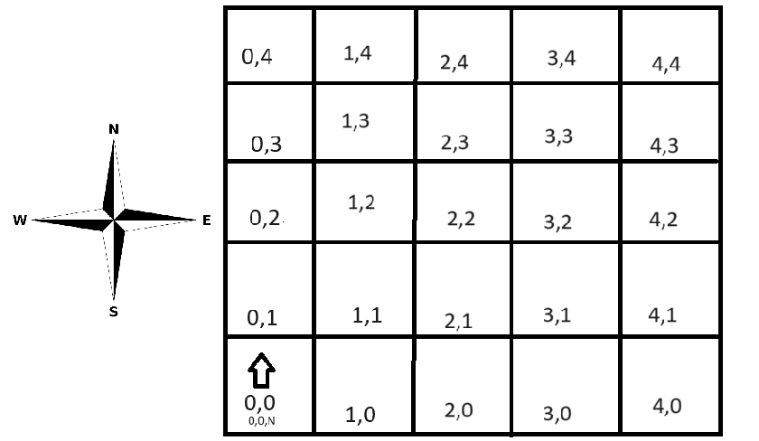

## Desafio: Controle de Robôs em Marte 🚀

## Descrição do Problema
A NASA precisa de um sistema para controlar robôs exploradores em Marte. O terreno marciano, de formato retangular, deve ser totalmente explorado pelos robôs, que capturam e enviam imagens da região para a Terra.

Cada robô é posicionado usando coordenadas cartesianas (x, y) e uma orientação (NORTH, SOUTH, EAST, WEST). Os comandos para mover os robôs são enviados como strings contendo 'L', 'R' e 'M':

- 'L' e 'R' rotacionam o robô 90 graus à esquerda ou à direita, respectivamente.
- 'M' move o robô uma posição à frente na direção em que está orientado.
## Exemplo
- Para um robô na posição inicial (0, 0, N):
- Comandos "MML" o moverão para a posição (0, 2, W).



## Objetivo do Programa
Desenvolver um software que permita aos engenheiros da NASA enviar comandos aos robôs e determinar suas posições finais após a execução dos comandos. O software será testado para garantir o comportamento correto antes da implementação real em Marte.

### Endpoints

#### Requisição com Movimento com rotação para direita:

- Request 
```
POST http://localhost:8080/rest/mars/MMRMMRMM
```
- Response Payload

```
(2, 0, S)
```
----------------------------------------------------------------------------
#### Requisição com Movimento para esquerda:

- Request 
```
POST http://localhost:8080/rest/mars/MML
```
- Response Payload

```
(0, 2, W)
```
----------------------------------------------------------------------------
#### Requisição com Comando inválido:

- Request 
```
POST http://localhost:8080/rest/mars/AAA
```
- Response Payload

```
httpStatus: 400 Bad Request
body: Invalid command: A
```
----------------------------------------------------------------------------
#### Requisição com Posição inválida:

- Request
```
POST http://localhost:8080/rest/mars/MMMMMMMMMMMMMMMMMMMMMMMM
```
- Response Payload

```
httpStatus: 400 Bad Request
body: Invalid command: Move out of bounds
```
----------------------------------------------------------------------------

